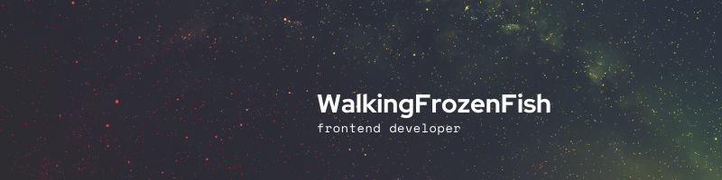
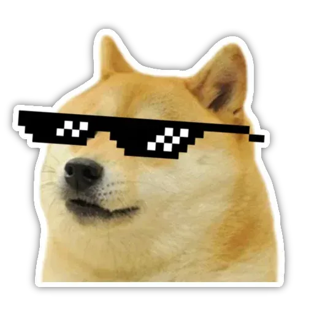

# Hello and welcome, nice to meet you :space_invader:

Welcome to my profile. My name is Oleg and I am a front-end developer from Kazakhstan. 
I am developing web applications on the MERN stack.

**My skills**

| Standart | Preprocessors | DataBases | Library/Framework/etc |
| -------- | ------------- | --------- | --------------------- |
|HTML      | SASS          | MongoDB   | React                 |
|CSS       | SCSS          |           | NodeJS                |
|JavaScript|               |           | TypeScript            |

**My Social**

[ My GitHub profile](https://github.com/WalkingFrozenFish) 

[ My LinkedIn](https://www.linkedin.com/in/oleg-chachin-5213aa199/) 

[ My Instagram](https://www.instagram.com/frozenbit13/?hl=ru/) 

[ My VK profile](https://vk.com/id194083267)

<!--    -->

<!-- https://stickers.cloud/en/pack/doge -->
<!-- https://www.flaticon.com/packs/social-15 -->
<!-- Icons -->
